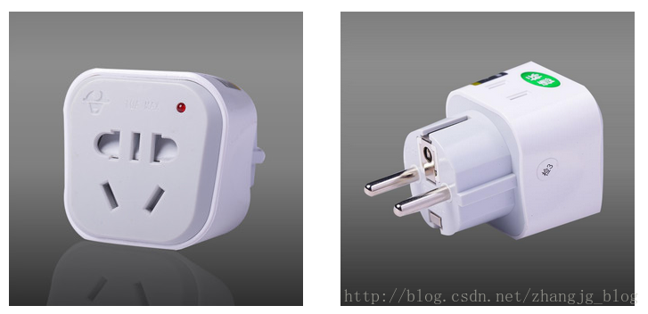

# Java 设计模式
设计模式（Design pattern）是一套被反复使用、多数人知晓的、经过分类编目的、代码设计经验的总结。使用设计模式是为了可重用代码、让代码更容易被他人理解、保证代码可靠性。 毫无疑问，设计模式于己于他人于系统都是多赢的，设计模式使代码编制真正工程化，设计模式是软件工程的基石，如同大厦的一块块砖石一样。项目中合理的运用设计模式可以完美的解决很多问题，每种模式在现在中都有相应的原理来与之对应，每一个模式描述了一个在我们周围不断重复发生的问题，以及该问题的核心解决方案，这也是它能被广泛应用的原因。

## 1. 设计模式的分类

总体来说设计模式分为三大类：

* 创建型模式，共五种：工厂方法模式、抽象工厂模式、单例模式、建造者模式、原型模式。

* 结构型模式，共七种：适配器模式、装饰器模式、代理模式、外观模式、桥接模式、组合模式、享元模式。

* 行为型模式，共十一种：策略模式、模板方法模式、观察者模式、迭代子模式、责任链模式、命令模式、备忘录模式、状态模式、访问者模式、中介者模式、解释器模式。

其实还有两类：并发型模式和线程池模式。用一个图片来整体描述一下：


## 2. 创建型模式
### 2.1 工厂方法模式(Factory Method)
工厂方法模式分为三种
(1) 普通工厂模式
(2) 多个工厂方法模式
(3) 静态工厂方法模式

#### 2.1.1 普通工厂方法
就是建立一个工厂类，对实现了同一接口的一些类进行实例的创建。

* 创建Sender接口，声明send()方法
```java
public interface Sender {

	void send();
}
```

```java
public class FTPSender implements Sender {

	@Override
	public void send() {
		System.out.println("FTPSender send...");
	}

}

```

```java
public class HTTPSender implements Sender {

	@Override
	public void send() {
		System.out.println("HTTPSender send...");
	}

}

```
```java
public class TCPSender implements Sender {

	@Override
	public void send() {
		System.out.println("TCPSender send...");
	}

}

```

```java
class SenderFactory {
	
	/**
	 * @param protocolType 协议类型
	 */
	Sender produce(String protocolType) {

		switch (protocolType) {
			case "TCP":
				return new TCPSender();
			case "FTP":
				return new FTPSender();
			case "HTTP":
				return new HTTPSender();
			default:
				System.out.println("请输入合适的类型");
				break;
		}
		return  null;
	}
}


```

```java
import org.junit.Test;

public class CommonFactoryPatternTest {

	@Test
	public void testSend() {
		
		SenderFactory senderFactory = new SenderFactory();
		
		senderFactory.produce("TCP").send();
		senderFactory.produce("FTP").send();
		senderFactory.produce("HTTP").send();
	}
}

```
#### 2.1.2多个工厂方法模式
是对普通工厂方法模式的改进，在普通工厂方法模式中，如果传递的字符串出错，则不能正确创建对象，而多个工厂方法模式是提供多个工厂方法，分别创建对象。

代码示例如下：
除了工厂类和测试类与普通工厂方法模式代码不同，其他均相同。

```java
public class SenderFactory {
	public Sender getTCPSender() {
		return new TCPSender();
	}
	public Sender getHTTPSender() {
		return new HTTPSender();
	}
	public Sender getFTPSender() { return new FTPSender(); }
}

```

```java
import org.junit.Test;

public class MutiFactoryMethodTest {

	@Test
	public void testSend() {
		
		SenderFactory senderFactory = new SenderFactory();
		senderFactory.getFTPSender().send();
		senderFactory.getTCPSender().send();
		senderFactory.getHTTPSender().send();
	}
}

```

#### 2.1.3 静态工厂方法模式
静态工厂方法模式就是在工厂类中的方法加上static关键字修饰，不再使用对象调用方法，而是直接使用类名直接条用方法。
```java
public class SenderFactory {
	
	public static Sender getTCPSender() {
		return new TCPSender();
	}
	public static Sender getHTTPSender() {
		return new HTTPSender();
	}
	public static Sender getFTPSender() {
		return new FTPSender();
	}
}

```

```java
import org.junit.Test;

public class StaticFactoryTest {

	@Test
	public void testSend() {
		SenderFactory.getFTPSender().send();
		SenderFactory.getTCPSender().send();
		SenderFactory.getHTTPSender().send();
	}
}

```
总体来说，工厂模式适合：凡是出现了大量的产品需要创建，并且具有共同的接口时，可以通过工厂方法模式进行创建。在以上的三种模式中，第一种如果传入的字符串有误，不能正确创建对象，第三种相对于第二种，不需要实例化工厂类，所以，大多数情况下，我们会选用第三种——静态工厂方法模式。

### 2.2. 抽象工厂方法模式
工厂方法模式有一个问题就是，类的创建依赖工厂类，也就是说，如果想要拓展程序，必须对工厂类进行修改，这违背了闭包原则，所以，从设计角度考虑，有一定的问题，如何解决？就用到抽象工厂模式，创建多个工厂类，这样一旦需要增加新的功能，直接增加新的工厂类就可以了，不需要修改之前的代码。抽象工厂方法模式的关键是创建多个工厂类。
以下为示例代码：

定义Sender接口
```java
public interface Sender {
	void send();
}

```

创建HTTPSender类并使用Sender接口
```java
public class HTTPSender implements Sender {

	@Override
	public void send() {
		System.out.println("HTTPSender send...");
	}

}
```
定义Provider接口
```java
public interface Provider {
	Sender produce();
}
```
创建HTTPSenderFactory类并使用Provider接口
```java
public class HTTPSenderFactory implements Provider {

	@Override
	public Sender produce() {
		return new HTTPSender();
	}
}
```
创建测试类AbstractFactoryTest,编写针对HTTPSender的测试类
```java
import org.junit.Test;

public class AbstractFactoryTest {
	
	@Test
	public void testHTTPSend() {
		Provider provider = new HTTPSenderFactory();
		Sender httpSender = provider.produce();
		httpSender.send();
	}
}
```

如果需要添加其他协议的代码支持，例如TCP协议，需要创建TCPSender类，再创建一个TCPSender对应的工厂类TCPSenderFactory类

```java
public class TCPSender implements Sender {

	@Override
	public void send() {
		System.out.println("TCPSender send...");
	}

}
```

```java
public class TCPSenderFactory implements Provider {
	
	@Override
	public Sender produce() {
		return new TCPSender();
	}
}
```

在测试类中添加testTCPSend方法
```java
public class AbstractFactoryTest {
	@Test
	public void testTCPSend() {
		Provider provider = new TCPSenderFactory();
		Sender tcpSender = provider.produce();
		tcpSender.send();
	}
}
```

### 2.3. 单例模式
这里暂时没有考虑多线程的情况，后面会补充进来
```java
package com.designpattern.creative.singleton;

public class Singleton {

	// 静态变量存储在方法区中
	private static Singleton instance = null;
	
	private Singleton() {
		
	}

	private static Singleton getInstance() {
		if(instance == null) {
			instance = new Singleton();
		}
		
		return instance;
	}
	
	public static void main(String [] args) {
		Singleton instance1 = Singleton.getInstance();
		Singleton instance2 = Singleton.getInstance();
		
		System.out.println(instance1 == instance2);
	}
}


```

### 2.4. 建造者模式
工厂类模式提供的是创建单个类的模式，而建造者模式则是将各种产品集中起来进行管理，用来创建复合对象，所谓复合对象就是指某个类具有不同的属性，其实建造者模式就是前面抽象工厂模式和最后的Test结合起来得到的。我们看一下代码

```java
public interface Builder {
	
	 void buildPart1();
	
	 void buildPart2();
	
	 void buildPart3();
	
	 Product buildProduct();
}
```

```java
package com.designpattern.creative.builder;

public class Product {
	
	private String part1;
	
	private String part2;
	
	private String part3;

	
	public String getPart1() {
		return part1;
	}

	public String getPart2() {
		return part2;
	}

	public String getPart3() {
		return part3;
	}

	public void setPart1(String part1) {
		this.part1 = part1;
	}

	public void setPart2(String part2) {
		this.part2 = part2;
	}

	public void setPart3(String part3) {
		this.part3 = part3;
	}


	
}

```

```java
package com.designpattern.creative.builder;

public class ConcreteBuilder implements Builder {

	private Product product;
	
	public ConcreteBuilder() {
		product = new Product();
	}
	
	@Override
	public void buildPart1() {
		product.setPart1("创建part1");
		System.out.println("创建part1");

	}

	@Override
	public void buildPart2() {
		product.setPart2("创建part2");
		System.out.println("创建part2");

	}

	@Override
	public void buildPart3() {
		product.setPart3("创建part3");
		System.out.println("创建part3");
	}

	@Override
	public Product buildProduct() {
		return product;
	}

}

```

```java
package com.designpattern.creative.builder;

public class Director {

    Product constructProduct(ConcreteBuilder concreteBuilder){
        concreteBuilder.buildPart1();
        concreteBuilder.buildPart2();
        concreteBuilder.buildPart3();
        return concreteBuilder.buildProduct();
    }
	
    Product constructProduct1(ConcreteBuilder concreteBuilder){
        concreteBuilder.buildPart1();
        concreteBuilder.buildPart3();
        return concreteBuilder.buildProduct();
    }
	
	
}

```

```java
package com.designpattern.creative.builder;

import org.junit.Test;

public class BuilderTest {

	@Test
	public void testBuilder() {
		//new Director().constructProduct(new ConcreteBuilder());
		
		new Director().constructProduct1(new ConcreteBuilder());
	}
}

```

### 2.5. 原型模式
* 原型模式虽然是创建型的模式，但是与工场模式没有关系，从名字即可看出，该模式的思想就是将一个对象作为原型，对其进行复制、克隆，产生一个和原对象类似的新对象。本小结会通过对象的复制，进行讲解。在Java中，复制对象是通过clone()实现的，先创建一个原型类：
很简单，一个原型类，只需要实现Cloneable接口，覆写clone方法，此处clone方法可以改成任意的名称，因为Cloneable接口是个空接口，你可以任意定义实现类的方法名，如cloneA或者cloneB，因为此处的重点是super.clone()这句话，super.clone()调用的是Object的clone()方法，而在Object类中，clone()是native的，具体怎么实现，我会在另一篇文章中，关于解读Java中本地方法的调用，此处不再深究。在这儿，我将结合对象的浅复制和深复制来说一下，首先需要了解对象深、浅复制的概念：
* 以下是JDK API对Cloneable接口的说明：
“一个类实现Cloneable接口，以指示Object.clone()方法，该方法对于该类的实例进行现场复制是合法的。 
在不实现Cloneable接口的实例上调用对象的克隆方法导致抛出异常CloneNotSupportedException 。 
按照惯例，实现此接口的类应使用公共方法覆盖Object.clone （受保护）。 有关覆盖此方法的详细信息，请参阅Object.clone() 。 
注意，此接口不包含clone方法。 因此，只能通过实现该接口的事实来克隆对象是不可能的。 即使克隆方法被反射地调用，也不能保证它成功。 ”

* 浅复制：将一个对象复制后，基本数据类型的变量都会重新创建，而引用类型，指向的还是原对象所指向的。
深复制：将一个对象复制后，不论是基本数据类型还有引用类型，都是重新创建的。简单来说，就是深复制进行了完全彻底的复制，而浅复制不彻底。

* 下面是一个浅复制的例子
```java
package com.designpattern.creative.prototype;

public class ShadowClone implements Cloneable {

	private int a; // 基本类型
	private int[] b; // 非基本类型

	@Override
	public Object clone() {
		ShadowClone sc = null;
		try {
			sc = (ShadowClone) super.clone();
		} catch (CloneNotSupportedException e) {
			e.printStackTrace();
		}
		return sc;
	}

	public int getA() {
		return a;
	}

	public void setA(int a) {
		this.a = a;
	}

	public int[] getB() {
		return b;
	}

	public void setB(int[] b) {
		this.b = b;
	}

	public static void main(String[] args) {

		ShadowClone c1 = new ShadowClone();
		c1.setA(100) ;
		c1.setB(new int[]{1000}) ;

		System.out.println("克隆前c1:  a="+c1.getA()+" b="+c1.getB()[0]);
		//克隆出对象c2,并对c2的属性A,B进行修改
		ShadowClone c2 = (ShadowClone) c1.clone();
		//对c2进行修改  ,c1的非基本类型也被修改了
		c2.setA(50) ;
		int []a = c2.getB() ;
		a[0]=5 ;
		c2.setB(a);
		System.out.println("克隆后c1:  a="+c1.getA()+" b="+c1.getB()[0]);
		System.out.println("克隆后c2:  a="+c2.getA()+ " b[0]="+c2.getB()[0]);
	}

}

```

以上的例子说明：Object对象的clone方法只能对基础数据类型进行复制，对其他类型的对象不起作用。

那么我们深复制一个新的数组该如何做呢？注意这里必须要使用Cloneable接口，否则会出现CloneNotSupportedException异常。

```java
package com.designpattern.creative.prototype;

public class DeepClone implements Cloneable{

	private int[] b; // 非基本类型

	// Object的clone方法只能复制基本数据类型
	@Override
	public Object clone() {
		DeepClone deepClone = null;
		try {
			deepClone = (DeepClone) super.clone();
			int[] t = deepClone.getB();
			int[] b1 = new int[t.length];
			for (int i = 0; i < b1.length; i++) {
				b1[i] = t[i];
			}
			deepClone.setB(b1);
		} catch (CloneNotSupportedException e) {
			e.printStackTrace();
		}
		return deepClone;
	}


	public int[] getB() {
		return b;
	}

	public void setB(int[] b) {
		this.b = b;
	}

	public static void main(String  [] args) {
		DeepClone deepClone = new DeepClone();
		deepClone.setB(new int[]{1000});

		DeepClone deepCloneNew = (DeepClone)deepClone.clone();
		deepCloneNew.setB(new int[]{500});

		System.out.println(deepClone.getB()[0] + ":" +deepCloneNew.getB()[0]);
	}
}

```

此处需要补深复制List的demo（待完成）

## 3 结构型模式
结构型模式包括适配器模式，装饰器模式，代理模式，外观模式，桥接模式，组合模式，享元模式

### 3.1 适配器模式
参考：原文：https://blog.csdn.net/zhangjg_blog/article/details/18735243 

本文讨论适配器模式。适配器模式是23中设计模式之一，它的主要作用是在新接口和老接口之间进行适配。它非常像我们出国旅行时带的电源转换器。为了举这个例子，我还特意去京东上搜了一下电源转换器，确实看到了很多地方的标准不一样。我们国家的电器使用普通的扁平两项或三项插头，而去外国的话，使用的标准就不一样了，比如德国，使用的是德国标准，是两项圆头的插头。如果去德国旅游，那么我们使用的手机充电器插头无法插到德国的插排中去，那就意味着我们无法给手机充电。怎样解决这个问题呢？只要使用一个电源转化器就行了。如下图所示：


该适配器下面的插头符合德国标准，可以插到德国的插排中去，上面提供的接口符合国标，可以供我们的手机充电器使用。

代码中有两个接口，分别为德标接口和国标接口，分别命名为DBSocketInterface和GBSocketInterface，此外还有两个实现类，分别为德国插座和中国插座，分别为DBSocket和GBSocket。为了提供两套接口之间的适配，我们提供了一个适配器，叫做SocketAdapter。除此之外，还有一个客户端，比如是我们去德国旅游时住的一家宾馆，叫Hotel，在这个德国旅馆中使用德国接口。

德标接口：

```java
package com.designpattern.structural.adapter;

public interface DBSocketInterface {
    /**
     * 这个方法的名字叫做：使用两项圆头的插口供电
     */
    void powerWithTwoRound();
}

```

德国插座实现德标接口

```java
package com.designpattern.structural.adapter;
/**
 * 德国插座
 */
public class DBSocket implements DBSocketInterface{

    public void powerWithTwoRound(){
        System.out.println("使用两项圆头的插孔供电");
    }
}  

```

德国旅馆是一个客户端，它里面有德标的接口，可以使用这个德标接口给手机充电：

```java
package com.designpattern.structural.adapter;

/**
 * 德国宾馆
 */
public class Hotel {

    //旅馆中有一个德标的插口
    private DBSocketInterface dbSocket;

    public Hotel(){}

    public Hotel(DBSocketInterface dbSocket) {
        this.dbSocket = dbSocket;
    }

    public void setSocket (DBSocketInterface dbSocket){
        this.dbSocket = dbSocket;
    }

    //旅馆中有一个充电的功能
    public void charge(){

        //使用德标插口充电
        // 适配器模式关键在这里，适配器模式中的dbSocket已经是SoketAdapter的实例对象了。
        dbSocket.powerWithTwoRound();
    }
}  


```

现在写一段代码进行测试：


```java
package com.designpattern.structural.adapter;

public class DBSoketTest {

    public static void main(String[] args) {

        //初始化一个德国插座对象， 用一个德标接口引用它
        DBSocketInterface dbSoket = new DBSocket();

        //创建一个旅馆对象
        Hotel hotel = new Hotel(dbSoket);

        //在旅馆中给手机充电
        hotel.charge();
    }
}  

```

运行程序，打印出以下结果： 使用两项圆头的插孔供电

现在我去德国旅游，带去的三项扁头的手机充电器。如果没有带电源适配器，我是不能充电的，因为不可能为了我一个旅客而为我更改墙上的插座，更不可能为我专门盖一座使用中国国标插座的宾馆。因为人家德国人一直这么使用，并且用的挺好，俗话说入乡随俗，我就要自己想办法来解决问题。对应到我们的代码中，也就是说，上面的Hotel类，DBSocket类，DBSocketInterface接口都是不可变的（由德国的客户提供），如果我想使用这一套API，那么只能自己写代码解决。

下面是国标接口和中国插座的代码。

```java
package com.designpattern.structural.adapter;

/**
 * 国标接口
 */
public interface GBSocketInterface {

    /**
     * 这个方法的名字叫做：使用三项扁头的插口供电
     * 本人英语就这个水平，从有道词典查得， flat意思好像是： 扁的
     */
    void powerWithThreeFlat();
}  

```
中国插座实现国标接口：

```java
package com.designpattern.structural.adapter;

/**
 * 中国插座
 */
public class GBSocket implements GBSocketInterface{

    @Override
    public void powerWithThreeFlat() {
        System.out.println("使用三项扁头插孔供电");
    }
}  

```

可以认为这两个东西是我带到德国去的，目前他们还不能使用，因为接口不一样。那么我必须创建一个适配器，这个适配器必须满足以下条件：

1    必须符合德国标准的接口，否则的话还是没办法插到德国插座中；
2    在调用上面实现的德标接口进行充电时，提供一种机制，将这个调用转到对国标接口的调用 。

这就要求：
1 适配器必须实现原有的旧的接口
2 适配器对象中持有对新接口的引用，当调用旧接口时，将这个调用委托给实现新接口的对象来处理，也就是在适配器对象中组合一个新接口。


下面给出适配器类的实现：

```java
package com.designpattern.structural.adapter;

public class SocketAdapter implements DBSocketInterface { // 实现旧接口

	// 组合新接口
	private GBSocketInterface gbSocket;

	/**
	 * 在创建适配器对象时，必须传入一个新街口的实现类
	 *
	 * @param gbSocket
	 */
	public SocketAdapter(GBSocketInterface gbSocket) {
		this.gbSocket = gbSocket;
	}

	/**
	 * 将对就接口的调用适配到新接口
	 */
	@Override
	public void powerWithTwoRound() {

		gbSocket.powerWithThreeFlat();
	}

}

```
这个适配器类满足了上面的两个要求。下面写一段测试代码来验证一下适配器能不能工作，我们按步骤一步步的写出代码，以清楚的说明适配器是如何使用的。

```java
package com.designpattern.structural.adapter;

public class AdapterTest {
	
	public static void main(String[] args) {

	        // 1 我去德国旅游，带去的充电器是国标的（可以将这里的GBSocket看成是充电器）
            GBSocketInterface gbSocket = new GBSocket();

            // 2 来到德国后， 找到一家德国宾馆住下 (这个宾馆还是上面代码中的宾馆，使用的依然是德国标准的插口)
            Hotel hotel = new Hotel();
            // 3 由于没法充电，我拿出随身带去的适配器，并且将我带来的充电器插在适配器的上端插孔中。这个上端插孔是符合国标的，我的充电器完全可以插进去。
            SocketAdapter socketAdapter = new SocketAdapter(gbSocket);
          
            // 再将适配器的下端插入宾馆里的插座上
            hotel.setSocket(socketAdapter);
            // 可以在宾馆中使用适配器进行充电了
            hotel.charge();
    }  
}

```

这说明适配器起作用了，上一个实例中打印的是：使用两项圆头的插孔供电。 现在可以使用三项扁头插孔供电了。我们并没有改变宾馆中的德标插口，提供了一个适配器就能使用国标的插口充电。这就是适配器模式的魅力：不改变原有接口，却还能使用新接口的功能。
根据上面的示例，想必读者应该能比较深入的了解到了适配器模式的魔力。下面给出适配器模式的定义（该定义来自于《Head First 设计模式》）：

适配器模式将一个类的接口转换成客户期望的另一个接口，让原本不兼容的接口可以合作无间。

适配器模式的三个特点：

* 适配器对象实现原有接口
* 适配器对象组合一个实现新接口的对象（这个对象也可以不实现一个接口，只是一个单纯的对象）
* 对适配器原有接口方法的调用被委托给新接口的实例的特定方法

### 3.2 装饰模式

顾名思义，装饰模式就是给一个对象增加一些新的功能，而且是动态的，要求装饰对象和被装饰对象实现同一个接口，装饰对象持有被装饰对象的实例，关系图如下：

Source类是被装饰类，Decorator类是一个装饰类，可以为Source类动态的添加一些功能，代码如下：

总觉得装饰模式和代理模式很像，后面总结一下。
```java
package com.designpattern.structural.decorator;

public interface Sourceable {
	void method();
}

```

```java
package com.designpattern.structural.decorator;

public class Source implements Sourceable{

	@Override
	public void method() {
		System.out.println("Source method...");
	}

}

```

```java
package com.designpattern.structural.decorator;

public class Decorator implements Sourceable {

	public Sourceable source;
	
	public Decorator(Sourceable source) {
		this.source = source;
	}
	
	@Override
	public void method() {
		System.out.println("before method...");
		source.method();
		System.out.println("after method...");
	}

}

```

```java
package com.designpattern.structural.decorator;

public class DecoratorTest {
	public static void main(String[] args) {
		 Sourceable source = new Source();  
		 Sourceable obj = new Decorator(source);  
		 obj.method();  

	}
}

```
### 3.3 代理模式
代理模式就是多一个代理类出来，替原对象进行一些操作，比如我们在租房子的时候回去找中介，为什么呢？因为你对该地区房屋的信息掌握的不够全面，希望找一个更熟悉的人去帮你做，此处的代理就是这个意思。再如我们有的时候打官司，我们需要请律师，因为律师在法律方面有专长，可以替我们进行操作，表达我们的想法。先来看看关系图

创建Sourceable接口，声明method方法
```java
public interface Sourceable {
	void method();
}

```

创建Source类并实现Sourceable接口中的方法
```java
public class Source implements Sourceable{

	@Override
	public void method() {
		System.out.println("Source method...");
	}

}

```

创建代理类Proxy，与Source类一样实现method方法，并且在构造方法中创建了source类的对象。
```java
public class Proxy implements Sourceable {

	private Source source;
	
	public Proxy() {
		this.source = new Source();
	}
	@Override
	public void method() {
		before();
		source.method();
		after();
	}
	
	public void before() {
		System.out.println("Proxy before....");
	}
	
	public void after() {
		System.out.println("Proxy after....");
	}

}

```

编写测试类，注意体会使用代理类和不使用代理类的区别
```java

public class ProxyTest {

	public static void main(String[] args) {

		// 不使用代理
		Source s = new Source();
		s.method();

		// 使用代理，代理能帮助我们做更多的事
		Proxy p = new Proxy();
		p.method();
	}
}

```
### 3.4 外观模式

外观模式是为了解决类与类之家的依赖关系的，像spring一样，可以将类和类之间的关系配置到配置文件中，而外观模式就是将他们的关系放在一个Facade类中，降低了类类之间的耦合度，该模式中没有涉及到接口，看下类图：（我们以一个计算机的启动过程为例）

我们先看下实现类：

```java
package com.designpattern.structural.facade;

public class CPU {

	public void startup() {
		System.out.println("cpu startup!");
	}

	public void shutdown() {
		System.out.println("cpu shutdown!");
	}
}

```
```java
package com.designpattern.structural.facade;

public class Disk {  
      
    public void startup(){  
        System.out.println("disk startup!");  
    }  
      
    public void shutdown(){  
        System.out.println("disk shutdown!");  
    }  
}  


```

```java
package com.designpattern.structural.facade;

public class Memory {  
      
    public void startup(){  
        System.out.println("memory startup!");  
    }  
      
    public void shutdown(){  
        System.out.println("memory shutdown!");  
    }  
}  


```

```java
package com.designpattern.structural.facade;

public class Computer {  
    private CPU cpu;  
    private Memory memory;  
    private Disk disk;  
      
    public Computer(){  
        cpu = new CPU();  
        memory = new Memory();  
        disk = new Disk();  
    }  
      
    public void startup(){  
        System.out.println("start the computer!");  
        cpu.startup();  
        memory.startup();  
        disk.startup();  
        System.out.println("start computer finished!");  
    }  
      
    public void shutdown(){  
        System.out.println("begin to close the computer!");  
        cpu.shutdown();  
        memory.shutdown();  
        disk.shutdown();  
        System.out.println("computer closed!");  
    }  
}  


```

```java
package com.designpattern.structural.facade;

import org.junit.Test;

public class FacadeTest {
	@Test
	public void testFacade() {
		Computer computer = new Computer();
		computer.startup();
		computer.shutdown();
	}
}

```

如果我们没有Computer类，那么，CPU、Memory、Disk他们之间将会相互持有实例，产生关系，这样会造成严重的依赖，修改一个类，可能会带来其他类的修改，这不是我们想要看到的，有了Computer类，他们之间的关系被放在了Computer类里，这样就起到了解耦的作用，这，就是外观模式！
### 3.5 桥接模式

### 3.6 组合模式

### 3.7 享元模式