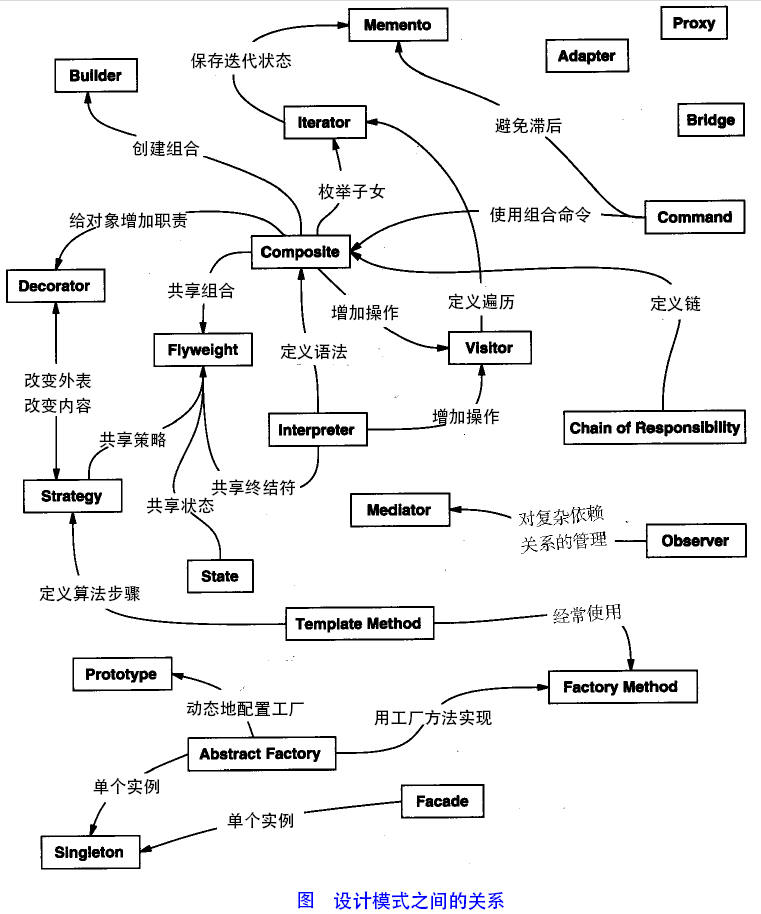

# Java 设计模式
设计模式（Design pattern）是一套被反复使用、多数人知晓的、经过分类编目的、代码设计经验的总结。使用设计模式是为了可重用代码、让代码更容易被他人理解、保证代码可靠性。 毫无疑问，设计模式于己于他人于系统都是多赢的，设计模式使代码编制真正工程化，设计模式是软件工程的基石，如同大厦的一块块砖石一样。项目中合理的运用设计模式可以完美的解决很多问题，每种模式在现在中都有相应的原理来与之对应，每一个模式描述了一个在我们周围不断重复发生的问题，以及该问题的核心解决方案，这也是它能被广泛应用的原因。

## 1. 设计模式的分类

总体来说设计模式分为三大类：

* 创建型模式，共五种：工厂方法模式、抽象工厂模式、单例模式、建造者模式、原型模式。

* 结构型模式，共七种：适配器模式、装饰器模式、代理模式、外观模式、桥接模式、组合模式、享元模式。

* 行为型模式，共十一种：策略模式、模板方法模式、观察者模式、迭代子模式、责任链模式、命令模式、备忘录模式、状态模式、访问者模式、中介者模式、解释器模式。

其实还有两类：并发型模式和线程池模式。用一个图片来整体描述一下：



## 2. 工厂方法模式(Factory Method)
工厂方法模式分为三种
(1) 普通工厂模式
(2) 多个工厂方法模式
(3) 静态工厂方法模式

### 2.1 普通工厂方法
就是建立一个工厂类，对实现了同一接口的一些类进行实例的创建。

* 创建Sender接口，声明send()方法
```java
public interface Sender {

	void send();
}
```

```java
public class FTPSender implements Sender {

	@Override
	public void send() {
		System.out.println("FTPSender send...");
	}

}

```

```java
public class HTTPSender implements Sender {

	@Override
	public void send() {
		System.out.println("HTTPSender send...");
	}

}

```
```java
public class TCPSender implements Sender {

	@Override
	public void send() {
		System.out.println("TCPSender send...");
	}

}

```

```java
class SenderFactory {
	
	/**
	 * @param protocolType 协议类型
	 */
	Sender produce(String protocolType) {

		switch (protocolType) {
			case "TCP":
				return new TCPSender();
			case "FTP":
				return new FTPSender();
			case "HTTP":
				return new HTTPSender();
			default:
				System.out.println("请输入合适的类型");
				break;
		}
		return  null;
	}
}


```

```java
import org.junit.Test;

public class CommonFactoryPatternTest {

	@Test
	public void testSend() {
		
		SenderFactory senderFactory = new SenderFactory();
		
		senderFactory.produce("TCP").send();
		senderFactory.produce("FTP").send();
		senderFactory.produce("HTTP").send();
	}
}

```
### 2.2 多个工厂方法模式
是对普通工厂方法模式的改进，在普通工厂方法模式中，如果传递的字符串出错，则不能正确创建对象，而多个工厂方法模式是提供多个工厂方法，分别创建对象。

代码示例如下：
除了工厂类和测试类与普通工厂方法模式代码不同，其他均相同。

```java
public class SenderFactory {
	public Sender getTCPSender() {
		return new TCPSender();
	}
	public Sender getHTTPSender() {
		return new HTTPSender();
	}
	public Sender getFTPSender() { return new FTPSender(); }
}

```

```java
import org.junit.Test;

public class MutiFactoryMethodTest {

	@Test
	public void testSend() {
		
		SenderFactory senderFactory = new SenderFactory();
		senderFactory.getFTPSender().send();
		senderFactory.getTCPSender().send();
		senderFactory.getHTTPSender().send();
	}
}

```

### 2.3 静态工厂方法模式
静态工厂方法模式就是在工厂类中的方法加上static关键字修饰，不再使用对象调用方法，而是直接使用类名直接条用方法。
```java
public class SenderFactory {
	
	public static Sender getTCPSender() {
		return new TCPSender();
	}
	public static Sender getHTTPSender() {
		return new HTTPSender();
	}
	public static Sender getFTPSender() {
		return new FTPSender();
	}
}

```

```java
import org.junit.Test;

public class StaticFactoryTest {

	@Test
	public void testSend() {
		SenderFactory.getFTPSender().send();
		SenderFactory.getTCPSender().send();
		SenderFactory.getHTTPSender().send();
	}
}

```
总体来说，工厂模式适合：凡是出现了大量的产品需要创建，并且具有共同的接口时，可以通过工厂方法模式进行创建。在以上的三种模式中，第一种如果传入的字符串有误，不能正确创建对象，第三种相对于第二种，不需要实例化工厂类，所以，大多数情况下，我们会选用第三种——静态工厂方法模式。

## 3. 抽象工厂方法模式
工厂方法模式有一个问题就是，类的创建依赖工厂类，也就是说，如果想要拓展程序，必须对工厂类进行修改，这违背了闭包原则，所以，从设计角度考虑，有一定的问题，如何解决？就用到抽象工厂模式，创建多个工厂类，这样一旦需要增加新的功能，直接增加新的工厂类就可以了，不需要修改之前的代码。抽象工厂方法模式的关键是创建多个工厂类。
以下为示例代码：

定义Sender接口
```java
public interface Sender {
	void send();
}

```

创建HTTPSender类并使用Sender接口
```java
public class HTTPSender implements Sender {

	@Override
	public void send() {
		System.out.println("HTTPSender send...");
	}

}
```
定义Provider接口
```java
public interface Provider {
	Sender produce();
}
```
创建HTTPSenderFactory类并使用Provider接口
```java
public class HTTPSenderFactory implements Provider {

	@Override
	public Sender produce() {
		return new HTTPSender();
	}
}
```
创建测试类AbstractFactoryTest,编写针对HTTPSender的测试类
```java
import org.junit.Test;

public class AbstractFactoryTest {
	
	@Test
	public void testHTTPSend() {
		Provider provider = new HTTPSenderFactory();
		Sender httpSender = provider.produce();
		httpSender.send();
	}
}
```

如果需要添加其他协议的代码支持，例如TCP协议，需要创建TCPSender类，再创建一个TCPSender对应的工厂类TCPSenderFactory类

```java
public class TCPSender implements Sender {

	@Override
	public void send() {
		System.out.println("TCPSender send...");
	}

}
```

```java
public class TCPSenderFactory implements Provider {
	
	@Override
	public Sender produce() {
		return new TCPSender();
	}
}
```

在测试类中添加testTCPSend方法
```java
public class AbstractFactoryTest {
	@Test
	public void testTCPSend() {
		Provider provider = new TCPSenderFactory();
		Sender tcpSender = provider.produce();
		tcpSender.send();
	}
}
```

## 4. 单例模式
这里暂时没有考虑多线程的情况，后面会补充进来
```java
package com.designpattern.creative.singleton;

public class Singleton {

	// 静态变量存储在方法区中
	private static Singleton instance = null;
	
	private Singleton() {
		
	}

	private static Singleton getInstance() {
		if(instance == null) {
			instance = new Singleton();
		}
		
		return instance;
	}
	
	public static void main(String [] args) {
		Singleton instance1 = Singleton.getInstance();
		Singleton instance2 = Singleton.getInstance();
		
		System.out.println(instance1 == instance2);
	}
}


```

## 4. 建造者模式
工厂类模式提供的是创建单个类的模式，而建造者模式则是将各种产品集中起来进行管理，用来创建复合对象，所谓复合对象就是指某个类具有不同的属性，其实建造者模式就是前面抽象工厂模式和最后的Test结合起来得到的。我们看一下代码

```java
public interface Builder {
	
	 void buildPart1();
	
	 void buildPart2();
	
	 void buildPart3();
	
	 Product buildProduct();
}
```

```java
package com.designpattern.creative.builder;

public class Product {
	
	private String part1;
	
	private String part2;
	
	private String part3;

	
	public String getPart1() {
		return part1;
	}

	public String getPart2() {
		return part2;
	}

	public String getPart3() {
		return part3;
	}

	public void setPart1(String part1) {
		this.part1 = part1;
	}

	public void setPart2(String part2) {
		this.part2 = part2;
	}

	public void setPart3(String part3) {
		this.part3 = part3;
	}


	
}

```

```java
package com.designpattern.creative.builder;

public class ConcreteBuilder implements Builder {

	private Product product;
	
	public ConcreteBuilder() {
		product = new Product();
	}
	
	@Override
	public void buildPart1() {
		product.setPart1("创建part1");
		System.out.println("创建part1");

	}

	@Override
	public void buildPart2() {
		product.setPart2("创建part2");
		System.out.println("创建part2");

	}

	@Override
	public void buildPart3() {
		product.setPart3("创建part3");
		System.out.println("创建part3");
	}

	@Override
	public Product buildProduct() {
		return product;
	}

}

```

```java
package com.designpattern.creative.builder;

public class Director {

    Product constructProduct(ConcreteBuilder concreteBuilder){
        concreteBuilder.buildPart1();
        concreteBuilder.buildPart2();
        concreteBuilder.buildPart3();
        return concreteBuilder.buildProduct();
    }
	
    Product constructProduct1(ConcreteBuilder concreteBuilder){
        concreteBuilder.buildPart1();
        concreteBuilder.buildPart3();
        return concreteBuilder.buildProduct();
    }
	
	
}

```

```java
package com.designpattern.creative.builder;

import org.junit.Test;

public class BuilderTest {

	@Test
	public void testBuilder() {
		//new Director().constructProduct(new ConcreteBuilder());
		
		new Director().constructProduct1(new ConcreteBuilder());
	}
}

```

## 6. 原型模式
原型模式虽然是创建型的模式，但是与工场模式没有关系，从名字即可看出，该模式的思想就是将一个对象作为原型，对其进行复制、克隆，产生一个和原对象类似的新对象。本小结会通过对象的复制，进行讲解。在Java中，复制对象是通过clone()实现的，先创建一个原型类：
很简单，一个原型类，只需要实现Cloneable接口，覆写clone方法，此处clone方法可以改成任意的名称，因为Cloneable接口是个空接口，你可以任意定义实现类的方法名，如cloneA或者cloneB，因为此处的重点是super.clone()这句话，super.clone()调用的是Object的clone()方法，而在Object类中，clone()是native的，具体怎么实现，我会在另一篇文章中，关于解读Java中本地方法的调用，此处不再深究。在这儿，我将结合对象的浅复制和深复制来说一下，首先需要了解对象深、浅复制的概念：
以下是JDK API对Cloneable接口的说明：
“一个类实现Cloneable接口，以指示Object.clone()方法，该方法对于该类的实例进行现场复制是合法的。 
在不实现Cloneable接口的实例上调用对象的克隆方法导致抛出异常CloneNotSupportedException 。 
按照惯例，实现此接口的类应使用公共方法覆盖Object.clone （受保护）。 有关覆盖此方法的详细信息，请参阅Object.clone() 。 
注意，此接口不包含clone方法。 因此，只能通过实现该接口的事实来克隆对象是不可能的。 即使克隆方法被反射地调用，也不能保证它成功。 ”

浅复制：将一个对象复制后，基本数据类型的变量都会重新创建，而引用类型，指向的还是原对象所指向的。
深复制：将一个对象复制后，不论是基本数据类型还有引用类型，都是重新创建的。简单来说，就是深复制进行了完全彻底的复制，而浅复制不彻底。

下面是一个浅复制的例子
```java
package com.designpattern.creative.prototype;

public class ShadowClone implements Cloneable {

	private int a; // 基本类型
	private int[] b; // 非基本类型

	@Override
	public Object clone() {
		ShadowClone sc = null;
		try {
			sc = (ShadowClone) super.clone();
		} catch (CloneNotSupportedException e) {
			e.printStackTrace();
		}
		return sc;
	}

	public int getA() {
		return a;
	}

	public void setA(int a) {
		this.a = a;
	}

	public int[] getB() {
		return b;
	}

	public void setB(int[] b) {
		this.b = b;
	}

	public static void main(String[] args) {

		ShadowClone c1 = new ShadowClone();
		c1.setA(100) ;
		c1.setB(new int[]{1000}) ;

		System.out.println("克隆前c1:  a="+c1.getA()+" b="+c1.getB()[0]);
		//克隆出对象c2,并对c2的属性A,B进行修改
		ShadowClone c2 = (ShadowClone) c1.clone();
		//对c2进行修改  ,c1的非基本类型也被修改了
		c2.setA(50) ;
		int []a = c2.getB() ;
		a[0]=5 ;
		c2.setB(a);
		System.out.println("克隆后c1:  a="+c1.getA()+" b="+c1.getB()[0]);
		System.out.println("克隆后c2:  a="+c2.getA()+ " b[0]="+c2.getB()[0]);
	}

}

```

以上的例子说明：Object对象的clone方法只能对基础数据类型进行复制，对其他类型的对象不起作用。